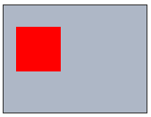

# Viewports in SVGs

Let us have a look at svgs and attributes that it accepts

```html
<svg id="svg-1">
  ...
</svg>
```

That is a simple svg element. You can add inline styling like so

```html
<svg id="svg-1" width="350" height="300px">
  ...
</svg>
```

You can add values for attributes with `width` as one of the following
- numeric value like `width=350`
- text value without unit like `width="350"`
- text value with unit like `width="350px"`
- **NOTE:** `width=350px` will produce an error

All the three will produce the same result.

Now, let us assume you have the following html with an svg and a rect inside it.

```html
<!doctype html>
<html>
<head>
  <title>Viewports in SVG</title>
  <style type="text/css">
    /* Minimal styling to svg */
    svg {
      background: #aeb7c6;
      border: 1px solid #000; /* borders are on the outside - takes extra space other than width and height. */
    }
  </style>
<body>
  <svg id="svg-1" width=160 height="120px">
    <rect x="14" y="24" width="50px" height="50px" fill="#f00"></rect>
  </svg>
</body>
</head>
</html>
```

The html will look something like this.



This means that
- `d3.select("#svg-1").style("width")` will return `160px`
- `d3.select("#svg-1").style("height")` will return `120px`

**Also, as per [cascading styling](https://goo.gl/i6I120) - the svg properties mentioned in style will override the ones mentioned inline.**

But what if we want to set the height and width of an svg dynamically based no-matter what the screen size is - the graph should
look good enough.

Enter viewports


## Viewports

A viewport is the area cross-section within which you limit your "eye". In other words, It is a piece of a cake from the whole cake or
think of it as a window on a wall, you will be able to view only what you see through the window - but in this case you have the power
to move the window from one point to another but will limit you within the size of the wall.

In svg, it is defined as
```html
<!-- starts at A(127, 138) and goes uptil B(127+40, 138+50) is what the viewport means -->
<h4>svg-2</h4>
<svg id="svg-2" width="400" height="350" viewBox="127 138 40 50">
  <circle cx="127" cy="138" r="40" fill="#0ff"></circle>
</svg>
```

This svg is actually `400px` wide and `350px` by height. But what the user will only be able to view is whatever lies
within the cross-section starting from point `(127, 138)` uptil `(127+40, 138+50)`. Thus, the viewport syntax looks like

```
viewBox=" __starting-x-coordinate__, __starting-y-coordinate__, __width-of-viewbox__, __height-of-viewbox__ "
```